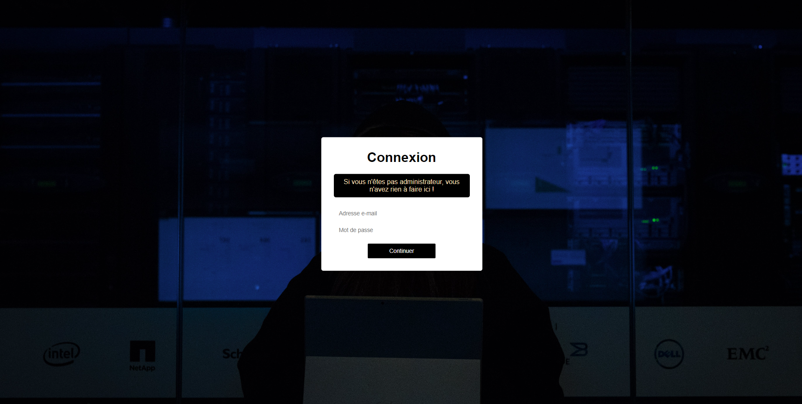

# Formulaire de connexion administrateur .

Dans le cadre de ma formation au HTML CSS.

## Aperçu

## Technologies utilisées

- HTML
- CSS

## Comment exécuter le projet

1. Clonez le dépôt localement : `git@github.com:AtticaWebDev/Parcours-code.git`
2. Explorez les projets dans le répertoire correspondant.

N'hésitez pas à me contacter pour toute question ou suggestion.
